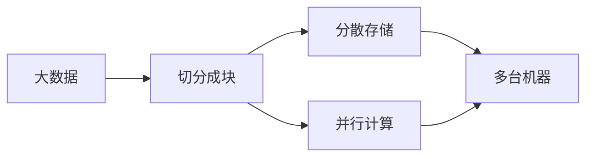
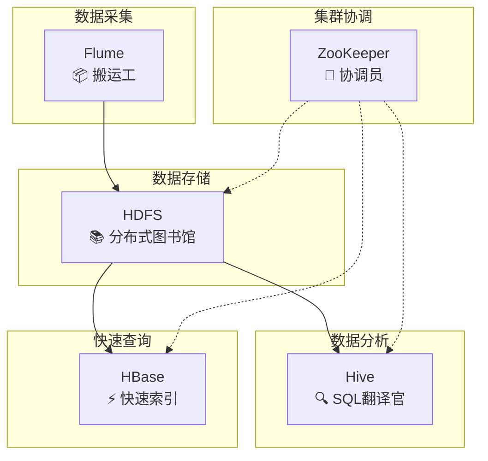
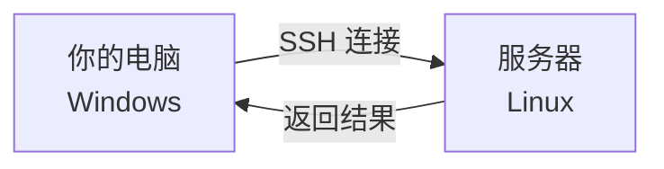

# 初识大数据与工作环境搭建

大数据平台应用实战 · 单元一 · 第1次课

<div class="pt-12">
  <span class="text-gray-500">浙江工商职业技术学院 · 人工智能学院</span>
</div>

<div class="abs-br m-6 flex gap-2">
  <span class="text-sm opacity-50">2025-2026 第二学期</span>
</div>

---
layout: section
---

# 🏪 欢迎加入"鲜生活超市"

你的大数据实习之旅，从今天开始！

---
layout: image-right
image: https://images.unsplash.com/photo-1604719312566-8912e9227c6a?w=800
---

# 📖 今日任务清单

作为新入职的**数据中心运维实习生**，你今天要完成：

<v-clicks>

- 🎯 了解"鲜生活"为什么需要大数据
- 🗺️ 认识企业数据中心的"全景地图"
- 🔌 搭建你的"远程工作台"
- 💻 学会基本的服务器操作命令

</v-clicks>

---
layout: section
---

# 第一部分

## 🤔 为什么需要大数据？

---

# 🛒 场景：双11 的一天

<div class="grid grid-cols-2 gap-8">

<div>

### 💬 讨论：超市需要处理什么？

<v-clicks>

- 📊 **实时监控** 100 万笔交易
- 🔒 **毫秒级识别** 盗刷异常
- 🔗 **整合** 会员 + 交易 + 库存
- 📦 **精准预测** 爆款商品备货

</v-clicks>

</div>

<div>

### ❓ Excel 能搞定吗？

<v-click>

| 挑战 | Excel 的极限 |
|------|-------------|
| 100万行数据 | 卡顿/崩溃 |
| 毫秒级响应 | 不可能 |
| 多系统整合 | 手动复制粘贴 |
| 实时分析 | 无法做到 |

</v-click>

<v-click>

> 🎯 **结论**：需要专门的大数据技术！

</v-click>

</div>

</div>

---

# 💡 什么是大数据？

<div class="grid grid-cols-2 gap-8">

<div>

### 📖 定义

<v-click>

> 大数据是指**规模超出传统工具处理能力**的数据集合，需要专门的技术来存储、处理和分析。

</v-click>

<v-click>

简单说：**Excel 搞不定的数据量 = 大数据**

</v-click>

</div>

<div>

### 🏢 热门应用场景（就业方向）

<v-clicks>

| 行业 | 应用 | 岗位 |
|------|------|------|
| 🛒 **电商零售** | 推荐系统、用户画像 | 数据分析师 |
| 🏦 **金融风控** | 反欺诈、信用评估 | 风控工程师 |
| 📱 **短视频** | 内容推荐、流量分析 | 算法工程师 |
| 🚗 **智慧交通** | 实时路况、调度优化 | 数据开发 |
| 🏥 **医疗健康** | 疾病预测、药物研发 | 数据科学家 |

</v-clicks>

</div>

</div>

---

# 📊 大数据的 4V 特征

<div class="grid grid-cols-4 gap-4 mt-8">

<div class="bg-blue-500/10 p-6 rounded-lg text-center">

### Volume
**大量**

<v-click>

日均 **100万+** 笔交易

</v-click>

</div>

<div class="bg-green-500/10 p-6 rounded-lg text-center">

### Velocity
**高速**

<v-click>

**秒级** 数据处理

</v-click>

</div>

<div class="bg-orange-500/10 p-6 rounded-lg text-center">

### Variety
**多样**

<v-click>

会员 + 交易 + 库存 + 日志

</v-click>

</div>

<div class="bg-purple-500/10 p-6 rounded-lg text-center">

### Value
**价值**

<v-click>

精准营销 → **复购率 +15%**

</v-click>

</div>

</div>

---

# 🇨🇳 大数据与国家战略

<div class="grid grid-cols-2 gap-8 mt-4">

<div>

### 国家战略支撑

<v-clicks>

- 📜 《"十四五"数字经济发展规划》
- 🏭 传统零售 → 智慧零售转型
- 🚀 培养复合型数字人才

</v-clicks>

</div>

<div>

### 技术自信

<v-clicks>

- 🐘 Hadoop 生态被全球广泛使用
- 🏢 阿里云、华为云国产方案成熟
- 📈 中国数字经济规模全球第二

</v-clicks>

</div>

</div>

<v-click>

<div class="mt-8 p-4 bg-blue-500/10 rounded-lg">

> 💡 **我们学的技术，正在推动国家数字化转型！**

</div>

</v-click>

---
layout: section
---

# 第二部分

## 🗺️ Hadoop 生态全景图

---
layout: center
class: text-center
---

# 🤔 用什么工具处理大数据？

<v-click>

我们知道了大数据的 4V 特征...

</v-click>

<v-click>

<div class="text-3xl mt-8">

那用什么技术来**存储**、**处理**、**分析**这些海量数据呢？

</div>

</v-click>

<v-click>

<div class="mt-8 p-4 bg-blue-500/10 rounded-lg">

> 🐘 **答案：Hadoop 生态**

</div>

</v-click>

---

# 🐘 什么是 Hadoop？

<div class="grid grid-cols-2 gap-8">

<div>

### 一句话定义

<v-click>

> Hadoop 不是一个单一软件，而是一套**处理海量数据的技术丛林**

</v-click>

<v-click>

### 解决什么问题？

传统单机数据库的两个核心矛盾：

- ❌ **存不下**：TB/PB 级数据单机放不下
- ❌ **算不动**：海量数据处理太慢

</v-click>

</div>

<div>

<v-click>

### Hadoop 的解决方案



</v-click>

<v-click>

> 🎯 **核心思想**：数据太大搬不动，就把计算指令送到数据所在的机器上！

</v-click>

</div>

</div>

---

# 🚗 Hadoop 的"三驾马车"

<div class="grid grid-cols-3 gap-4 mt-4">

<div class="bg-blue-500/10 p-4 rounded-lg">

### 📦 HDFS
**分布式文件存储**

<v-click>

- 大文件切成块（Block）
- 分散存储在多台机器
- 自带 3 副本容错

</v-click>

<v-click>

> 类比：**分布式图书馆**

</v-click>

</div>

<div class="bg-green-500/10 p-4 rounded-lg">

### ⚙️ MapReduce
**分布式计算框架**

<v-click>

- **Map**：分解任务到各节点
- **Reduce**：汇总结果
- 并行处理，速度 × N

</v-click>

<v-click>

> 类比：**流水线工人**

</v-click>

</div>

<div class="bg-orange-500/10 p-4 rounded-lg">

### 🎛️ YARN
**资源管理调度**

<v-click>

- 协调集群 CPU 和内存
- 让多个任务有序运行
- 支持 Spark、Flink 等

</v-click>

<v-click>

> 类比：**资源管家**

</v-click>

</div>

</div>

---

# 🏗️ "鲜生活"数据中心架构

用比喻来理解复杂的技术组件：



---

# 🧩 生态组件分类表

| 类别 | 组件 | 比喻 | 作用 |
|------|------|------|------|
| **存储** | HDFS | 分布式图书馆 | 存放 TB/PB 级数据 |
| **计算** | MapReduce / Spark | 流水线工人 | 并行处理数据 |
| **数据仓库** | Hive | SQL 翻译官 | 用 SQL 查询大数据 |
| **NoSQL** | HBase | 会员卡索引 | 毫秒级随机读写 |
| **数据采集** | Flume / Sqoop | 物流搬运工 | 采集日志 / 导入导出数据库 |
| **协调服务** | ZooKeeper | 指挥官 | 集群状态同步 |

<v-click>

<div class="mt-4 p-3 bg-blue-500/10 rounded-lg">

> 💡 **本课程重点**：HDFS（存储）、Hive（分析）、Flume（采集）

</div>

</v-click>

---

# 🧠 角色比喻速记

| 组件 | 比喻 | 作用 |
|------|------|------|
| **NameNode** | 图书馆索引管理员 | 知道所有数据存在哪 |
| **DataNode** | 一排排书架 | 实际存储数据的地方 |
| **HDFS** | 整个图书馆 | 分布式文件系统 |
| **Hive** | SQL 翻译官 | 让你用 SQL 查询大数据 |
| **HBase** | 快速索引卡片 | 毫秒级查询会员信息 |
| **Flume** | 物流搬运工 | 不停地收集各门店日志 |
| **ZooKeeper** | 协调员/指挥官 | 保证大家配合默契 |

<v-click>

> 💡 **先记住比喻，后续我们逐一深入每个组件！**

</v-click>

---
layout: section
---

# 第三部分

## 🔌 搭建你的远程工作台

---
layout: center
class: text-center
---

# 🤔 这些服务跑在哪里？

<v-click>

我们知道了 Hadoop 生态的各个组件...

</v-click>

<v-click>

<div class="text-3xl mt-8">

那这些 HDFS、Hive、HBase 都**运行在什么系统**上呢？

</div>

</v-click>

<v-click>

<div class="mt-8 p-4 bg-blue-500/10 rounded-lg">

> 🐧 **答案：Linux 服务器**

</div>

</v-click>

---
layout: two-cols
---

# 💻 为什么用 Linux？

<v-clicks>

- **稳定性强**：服务器 7×24 运行
- **开源免费**：企业成本更低
- **命令行高效**：批量操作更快
- **安全性好**：权限控制严格

</v-clicks>

::right::

<v-click>

# 🌐 远程工作原理



</v-click>

<v-click>

> 🔑 **SSH** = Secure Shell  
> 安全的远程登录协议

</v-click>

---
layout: section
---

# 第四部分

## 🖥️ 启动你的 Linux 服务器

---

# 🚀 启动虚拟机

<div class="grid grid-cols-2 gap-8">

<div>

### 操作步骤

<v-clicks>

1. 打开 **VMware Workstation**
2. 找到 CentOS 虚拟机
3. 点击 **"启动此虚拟机"**
4. 等待系统启动完成（约 30 秒）

</v-clicks>

</div>

<div>

<v-click>

### ⚠️ 注意事项

- 不要点击虚拟机窗口内部（会锁定鼠标）
- 按 `Ctrl + Alt` 可释放鼠标
- 如果启动失败，检查是否已有实例在运行

</v-click>

</div>

</div>

---

# 🔑 登录 CentOS 系统

<div class="grid grid-cols-2 gap-8">

<div>

### 登录信息

<v-clicks>

- **用户名**：`centos7`
- **密码**：`123456`
- 输入密码时**不会显示**任何字符（这是正常的！）

</v-clicks>

</div>

<div>

<v-click>

### 登录成功标志

```bash
[centos7@localhost ~]$ _
```

看到命令提示符 = 登录成功！

</v-click>

<v-click>

> 💡 **小技巧**：`#` 表示管理员，`$` 表示普通用户

</v-click>

</div>

</div>

---

# 📍 获取虚拟机 IP 地址

<div class="grid grid-cols-2 gap-8">

<div>

### 操作步骤

<v-clicks>

1. 在 CentOS 命令行输入：
```bash
ip addr
```

2. 找到 `ens33` 网卡的 IP 地址
3. **记录下来**（写在纸上或记事本）

</v-clicks>

</div>

<div>

<v-click>

### 示例输出

```bash {4}
2: ens33: <BROADCAST,MULTICAST,UP>
    link/ether 00:0c:29:xx:xx:xx
    inet 192.168.217.128/24
         ^^^^^^^^^^^^^^^^
         这就是你的 IP！
```

</v-click>

<v-click>

> ⚠️ **每台机器的 IP 不同，务必记录自己的！**

</v-click>

</div>

</div>

---

# 🛠️ MobaXterm 连接实操

<div class="grid grid-cols-2 gap-8">

<div>

### 连接步骤

<v-clicks>

1. 打开 MobaXterm
2. 点击 "Session" → "SSH"
3. 输入服务器 IP 地址
4. 输入用户名和密码
5. 连接成功！

</v-clicks>

</div>

<div>

### 连接信息

```yaml
IP 地址: 192.168.10.XXX
用户名: centos7
密码: 123456
端口: 22 (默认)
```

</div>

</div>

<v-click>

<div class="mt-4 p-4 bg-orange-500/10 rounded-lg">

⚠️ **常见坑点**：Windows 网络适配器中 VMnet8 被禁用！  
解决：控制面板 → 网络适配器 → 右键启用 VMnet8

</div>

</v-click>

---
layout: section
---

# 第四部分

## 💻 Linux 基础命令

---
layout: two-cols
---

# 🎮 五大核心命令

| 命令 | 作用 | 示例 |
|------|------|------|
| `pwd` | 我在哪？ | `/home/student` |
| `ls` | 看看有啥 | `data logs` |
| `cd` | 去哪里 | `cd data` |
| `cat` | 看内容 | `cat file.txt` |
| `mkdir` | 建文件夹 | `mkdir mydir` |

::right::

### 实战演示

```bash
# 1. 查看当前位置
$ pwd
/home/centos7

# 2. 查看目录内容
$ ls
bigdata  文档  下载

# 3. 进入 bigdata 目录
$ cd bigdata

# 4. 查看文件内容
$ cat hello.txt
Hello, Big Data!

# 5. 创建新文件夹
$ mkdir 张三
```

---

# 🏆 闯关任务：创建你的大数据工作目录

<div class="grid grid-cols-2 gap-8">

<div>

### 任务目标

<v-clicks>

1. 创建 `/home/centos7/bigdata/你的姓名/` 目录
2. 在目录中创建 `hello.txt` 文件
3. 向文件中写入 "Hello, Big Data!"
4. 验证文件内容
5. 截图提交成功界面

</v-clicks>

</div>

<div>

### 参考命令

```bash
# 1. 创建工作目录（用你的真实姓名）
mkdir -p /home/centos7/bigdata/张三

# 2. 进入目录
cd /home/centos7/bigdata/张三

# 3. 创建文件并写入内容
echo "Hello, Big Data!" > hello.txt

# 4. 验证文件内容
cat hello.txt

# 5. 确认目录结构
pwd && ls -l
```

</div>

</div>

---

# ✅ 任务验收标准

<div class="grid grid-cols-3 gap-4">

<div class="bg-blue-500/10 p-4 rounded-lg text-center">

### 检查点 1
**目录创建成功**

```bash
ls /home/centos7/bigdata/
# 应显示你的姓名文件夹
```

</div>

<div class="bg-green-500/10 p-4 rounded-lg text-center">

### 检查点 2
**文件存在**

```bash
ls /home/centos7/bigdata/张三/
# 应显示 hello.txt
```

</div>

<div class="bg-orange-500/10 p-4 rounded-lg text-center">

### 检查点 3
**内容正确**

```bash
cat .../张三/hello.txt
# 应显示 Hello, Big Data!
```

</div>

</div>

<v-click>

<div class="mt-6 p-4 bg-purple-500/10 rounded-lg text-center">

> 🎯 **完成后截图**：显示 `pwd`、`ls`、`cat` 的输出即可提交！

</div>

</v-click>

---

# ⚠️ 安全警示：rm -rf 事故

<div class="p-6 bg-red-500/10 rounded-lg">

### 真实案例

> 2017年，某公司运维工程师误执行 `rm -rf /`，导致整个服务器数据被清空，公司直接倒闭。

</div>

<v-click>

### 🛡️ 运维铁律

- **三思而后行**：执行危险命令前先确认路径
- **备份先行**：重要操作前先备份
- **最小权限**：日常不使用 root 账号

</v-click>

<v-click>

<div class="mt-4 p-4 bg-blue-500/10 rounded-lg">

> 💼 **职业素养**：对生产环境保持敬畏之心！

</div>

</v-click>

---
layout: section
---

# 第五部分

## 🧪 配置体验实验

---

# 🧪 配置体验："为什么连不上了？"

<div class="text-center mb-4">

> � **实验目的**：通过"制造故障"来理解各项配置的作用

</div>

<div class="grid grid-cols-2 gap-8">

<div>

### 实验规则

<v-clicks>

1. ✅ 确认当前 SSH **能正常连接**
2. 🔧 **依次尝试**下列 3 个实验
3. 📝 记录每次的现象
4. 🔄 每次实验后**恢复正常**

</v-clicks>

</div>

<div>

<v-click>

### ⚠️ 重要提示

- 实验在**虚拟机内**操作
- 每次只改**一项配置**
- 改完后用 MobaXterm **尝试重连**
- 观察失败现象，然后**恢复配置**

</v-click>

</div>

</div>

---

# 🔬 实验 1：关闭 SSH 服务

<div class="grid grid-cols-2 gap-8">

<div>

### 操作步骤

```bash
# 1. 关闭 SSH 服务
sudo systemctl stop sshd

# 2. 用 MobaXterm 尝试重连
#    → 观察失败现象

# 3. 恢复服务
sudo systemctl start sshd

# 4. 再次连接，确认恢复
```

</div>

<div>

### 📝 现象记录

<v-clicks>

- **失败表现**：连接超时 / Connection refused
- **原因**：SSH 服务没运行，没人"接电话"
- **检查命令**：`systemctl status sshd`
- **学到了**：SSH 服务必须开启才能远程连接

</v-clicks>

</div>

</div>

---

# 🔬 实验 2：开启防火墙

<div class="grid grid-cols-2 gap-8">

<div>

### 操作步骤

```bash
# 1. 开启防火墙
sudo systemctl start firewalld

# 2. 用 MobaXterm 尝试重连
#    → 观察失败现象

# 3. 关闭防火墙
sudo systemctl stop firewalld

# 4. 再次连接，确认恢复
```

</div>

<div>

### 📝 现象记录

<v-clicks>

- **失败表现**：能 ping 通，但 SSH 连不上
- **原因**：防火墙拦截了 22 端口
- **检查命令**：`systemctl status firewalld`
- **学到了**：防火墙会阻止特定端口的访问

</v-clicks>

</div>

</div>

---

# 🔬 实验 3：禁用 Windows VMnet8

<div class="grid grid-cols-2 gap-8">

<div>

### 操作步骤

```text
# 1. Windows 控制面板 → 网络适配器
# 2. 右键 VMnet8 → 禁用

# 3. 在 CMD 中 ping 虚拟机 IP
#    → 观察失败现象

# 4. 右键 VMnet8 → 启用

# 5. 再次 ping / SSH，确认恢复
```

</div>

<div>

### 📝 现象记录

<v-clicks>

- **失败表现**：ping 不通，请求超时
- **原因**：Windows 端网络通道被切断
- **检查方法**：查看网络适配器状态
- **学到了**：VMnet8 是宿主机与虚拟机通信的桥梁

</v-clicks>

</div>

</div>

---

# ✅ 实验小结

<div class="grid grid-cols-3 gap-4 mt-4">

<div class="bg-red-500/10 p-4 rounded-lg text-center">

### SSH 服务
`systemctl stop sshd`

→ 连接被拒绝

**必须运行**

</div>

<div class="bg-orange-500/10 p-4 rounded-lg text-center">

### 防火墙
`systemctl start firewalld`

→ ping 通但连不上

**需要关闭或开放端口**

</div>

<div class="bg-blue-500/10 p-4 rounded-lg text-center">

### VMnet8
禁用网络适配器

→ ping 不通

**Windows 端必须启用**

</div>

</div>

<v-click>

<div class="mt-6 p-4 bg-purple-500/10 rounded-lg text-center">

> 🎯 **收获**：了解了 SSH 连接的 3 个关键配置点，以后遇到问题可以逐一排查！

</div>

</v-click>

---
layout: center
class: text-center
---

# 📝 本节总结

<div class="grid grid-cols-4 gap-4 mt-8 text-left">

<div class="bg-blue-500/10 p-4 rounded-lg">

### 4V 特征
Volume · Velocity  
Variety · Value

</div>

<div class="bg-green-500/10 p-4 rounded-lg">

### 生态全景
HDFS · Hive  
HBase · Flume · ZK

</div>

<div class="bg-orange-500/10 p-4 rounded-lg">

### 远程连接
MobaXterm  
SSH 协议

</div>

<div class="bg-purple-500/10 p-4 rounded-lg">

### 基础命令
pwd · ls · cd  
cat · mkdir

</div>

</div>

---
layout: center
class: text-center
---

# 🔜 下节预告

<div class="text-left mt-8">

<v-clicks>

### 下节课内容

- Linux 进阶命令（cp/mv/rm/vi）
- VMware 网络模式详解
- 静态 IP 配置实战
- 网络配置体验实验

</v-clicks>

</div>

<v-click>

<div class="mt-8 p-4 bg-blue-500/10 rounded-lg">

> 💡 **预习建议**：查阅 vi 编辑器基本操作

</div>

</v-click>

**下节课内容**：

- Linux 进阶命令（cp/mv/rm/vi）
- 静态 IP 配置实战
- 网络故障排查演练

</v-click>

---
layout: end
---

# 谢谢！

下节课见 👋

<div class="abs-br m-6">
  <span class="text-sm opacity-50">大数据平台应用实战 · 单元一</span>
</div>
